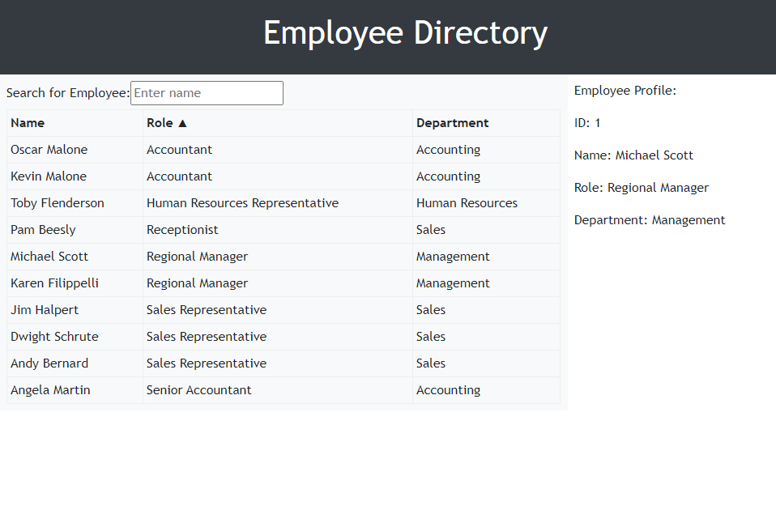

# Employee Directory

## Link to deployed application:

https://roan1088.github.io/employee-directory/

## Description
A employee directory to view non-sensitive data about other employees. This app is created using React.

## Table of Contents
- [Usage](#usage)
- [Contributing](#contributing)
- [Questions](#questions)

## Usage
Follow the link to the deployed application to get started. Click on the table header to sort them by ascending or descending order. You can also search for an employee by name. Click on the employee to view their profile.

## Contributing
Nothing

## Questions
If you have any questions about the repo, open an issue or contact me directly at rohan_188@yahoo.com. You can find more of my work at [roan1088](https://github.com/roan1088).